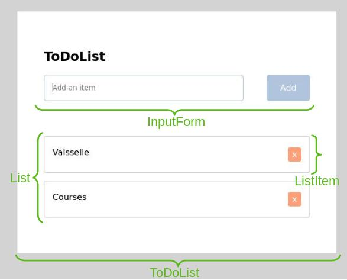

# TP 1

## Objectif
On va développer une ToDoListe, c'est-à-dire une liste de tâches à effectuer.
Notre application comporte un champ pour entrer le nom de l'item, et la liste des items.

## Consignes
Le projet est un projet standard créé à l'aide de `create-react-app`. Les composants sont situés dans le dossier `src/comporents/`.  
Le composant racine affiché est l'App. Il fait appel au composant ToDoList.  
On peut voir dans la méthode `render()` qu'un composant ToDoList fait appel à d'autres composants: InputForm et List.  
Ces deux composants envoie des évènements que l'on doit intercepter au moyen de Handlers.  
Par exemple, l'InputForm fait remonter un évènement onInput lorsque la valeur du `form` change. Cet évènement est intercepté par le inputHandler.  

Pour l'instant, le seul fichier à compléter est `src/components/ToDoList.jsx`. À chaque numéro de question correspond une TODO.  

1. En s'inspirant du `inputHandler()`, compléter le `submitHandler()`. Ce handler intercepte la valeur du onSubmit de l'InputForm. 

2. Compléter de la même manière le `deleteHandler()`, appelé lors d'un clic sur le bouton delete d'un objet. 

3. Afficher la liste des objets dans le composant List. 

 
  
Indication 1. 

   On doit mettre à jour l'état de ToDoList pour ajouter l'élément entré par l'utilisateur (stocké dans la variable `pendingItem`) à la liste des éléments `list`.

 
  
Indication 2. 

   Il faut retirer de `list` l'élément à la position `index`.

 
  
Indication 3. 

   Regardez du côté du state du composant.

